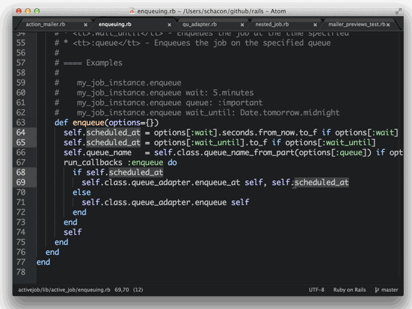

#  Kurze Tour durch mein Entwicklerwohnzimmer

.fx: fullImage

---

#  Jetbrains PyCharm

.fx: fullImage

---

#  Was erwartet ihr von einer IDE?

# Presenter Notes

Gibt's da Meinungen bei den Zuhörern?

---

.fx: fullImage

# Presenter Notes

**Eierlegende Wollmilchsau**

Muss ich während der Entwicklung selten verlassen

---

#  Was ich **nicht** erwarte ...

---

Geht aber auch ... (siehe später in Plugins)

# Presenter Notes

**Vim-artige Textmanipulation**

Ich komme eher vom Klavier und spiele lieber Accorde als Licks

Symbolmanipulationen sind mir wichtiger (z.B. Name und Move Refactoring)

Eine IDE ist was anderes als ein Text Editor

Programmieren ist auch was anderes als Text editieren

**Ich will einen Pedanten mit Lexikonwissen haben, der mir beim Tippen hilft**

---

# Presenter Notes

**Pair programming ohne pair programmer**

Jemand der auf alles achtet, was ich gern vergesse

... der jeden Syntaxfehler sieht

... der PEP8 Fehler sofort sieht

... der mich auf fehlende Parameter in format strings hinweist

... der alle Feinheiten der verschiedenen Python Versionen kennt

... der weiß wo alle Funktionen, Klassen und Module sind

... der mir beim Fixen der Fehler hilft

---

# Presenter Notes

den ich aber getrost ignorieren kann **(Quick fix Warnung aus)**

---

* Projekt Interpreter
* Projektstruktur (source root, excludes, templates)
* Mehrere Repositories in einem Projekt (synchronisierbare branches)
* Zum Projekt gehörige Datenbanken im Projekt
* [.idea](https://www.jetbrains.com/help/pycharm/5.0/project.html)
* Terminal in Pycharm öffnet Pojektordner (gut mit [direnv](http://direnv.net/))
* Strukturierungshilfen (Favoriten, Bookmarks, QuickLists)

# Presenter Notes

**Projektorientiert**

Meine Art zu Arbeiten ist eher Projektorientiert

Z.B. Wechsel in den Projektordner aktiviert automatisch Interpreter

In PyCharm: Terminal öffnet Projektordner und aktiviert richtigen Interpreter

---

## Unterstützt meine Frameworks und Tools

* Flask
* SQLalchemy
* Zurb Foundation
* Vagrant
* Docker
* Bequemer Datenbankzugriff auf postgres, mysql, slite, ...
* [uvm.](https://www.jetbrains.com/help/pycharm/5.0/languages-and-frameworks.html)

*(Teilweise nur Professional Edition)*

---

# formate, Formate, FORMATE!1!!

* Python
* sh
* .ignore
* HTML
* JSON / YAML
* Javascript / CoffeScript
* CSS / SCSS / LESS
* Jinja2 / Mako / Django Templates
* SQL (alle gebrächlichen Dialekte)
* Markdown **(Multimarkdown)** / restructuredText / AsciiDoc
* Ruby 

Alles geht irgendwie (Plugins oder Textmate bundles)

---

# Erlernbarkeit 

* Productivity Guide
* ``Help -> Find Action``
* Settings gut strukturiert mit Volltextsuche
* [Sehr gute Dokumentation](https://www.jetbrains.com/pycharm/documentation/)

---

#  Konfigurierbarkeit

* Layout der Toolbars (Floating, Docked, Pinned, viele Details anpassbar)
* Optionen direkt in Find Action / Search Everywhere anpassen 
* Alle Farben gut anpassbar / Farbenblindenmodus / Darcula Theme!1!!
* File / Code / Live Templates
* Frei konfigurierbare Maus/Keyboard Shortcuts für wirklich alles
* Selbstkonfigurierbare Quicklists

[Plugins!](https://plugins.jetbrains.com/?pycharm)

* [Key Promoter](https://plugins.jetbrains.com/plugin/1003)
* [MultiMarkdown](http://vladsch.com/product/multimarkdown)
* [Bash Support](https://github.com/jansorg/BashSupport)
* [.ignore](https://plugins.jetbrains.com/plugin/7495?pr=pycharm)
* [ideavim](https://confluence.jetbrains.com/display/PYH/Configuring+PyCharm+to+work+as+a+Vim+editor)

---

# Hilfe bei der täglichen Arbeit

* Statische Code Analyse (IMHO unerreicht von anderen Tools)
* Viele Quick Fixes für Konfigurationsprobleme, fehlende Pakete, Probleme im Code
* Überall kann man einfach suchen (Projektdateinamen, Edtor, Global, Scope, ...)
* Gute Integration von allen gängigen Entwicklungsaktivitäten

# Presenter Notes

Code ausführen (Run script, Evaluate Expression)

Compare Files / read diffs

update/commit/push code from VCS (git, mercurial, svn, ...)

create/switch branches/tags

Local History / VCS history

Vor Commit: Code Analyse / Import Optimierung / Todos checken

Share project on Github

Share code / console output as gist

---

## Liebe zum Detail

* ``Esc`` -> spring von überall zurück in den letzten aktiven Editor
* ``Alt, Alt`` -> Toolfensterknöpfe einblenden
* ``Shift, Shift`` -> Search Everywhere
* ``Alt+Enter`` (über Fehler/Warnung/Intention) -> Quick Fix
* ``F1`` -> Terminal einblenden und wieder ausblenden
* ``Strg+o`` | ``Strg+g`` -> Dateinterne Navigation
* Toolfenster Navigation (z.B. ``Alt+<1-9>`` - frei konfigurierbar)
* Editfenster on Steroids (Annotations / Code Folding / Code Lens / Changes)
* Verschiedene Darstellungsmodi (Presentation, Distraction Freee)

**CamelCase / slug_case sensitive Suche**

# Presenter Notes

Suche1: monty-python.jpg -> mp

Suche2: pycharm/wollmilchsa.jpg -> upy/wo

Optionen1: line numbers

Optionen2: code folding

---

# Bequemlichkeit

* Code Vervollständigung
* Code Navigation
* Switcher (``Strg+Tab``, Recent Files: ``Strg+E``)
* TODOs werden gescannt und in eigenem Toolfenster angezeigt
* Schnelle Erreichbarkeit aller wichtigen Funktionen

---

# Analyse / Fehlervermeidung / Optimierung

* Code inspections mit Quick Fixes direkt im Editor
* Guter Visueller Debugger
* Visueller Profiler

---

# Testen

* Tools -> Python Integrated Tools
* Schöne Darstellung, mit Navigation zum betroffenen Code
* Konkrete Testfunktion, Klasse, Modul vom Code aus starten
* Auto rerun von Tests
