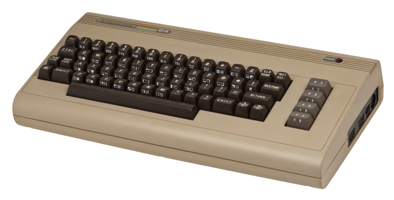
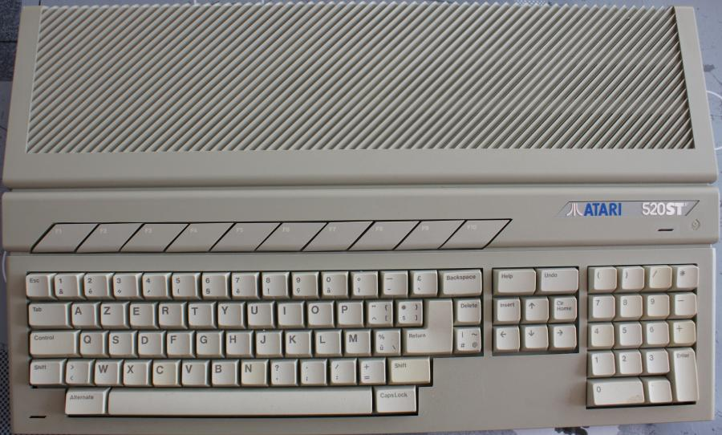
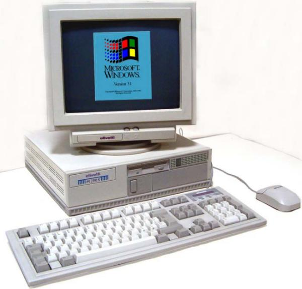
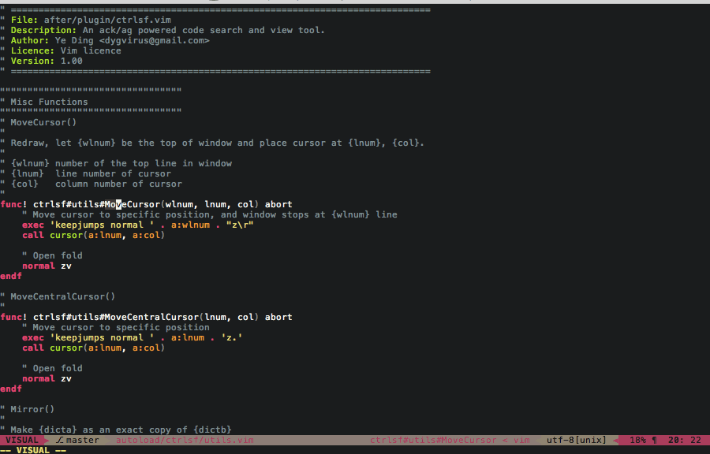
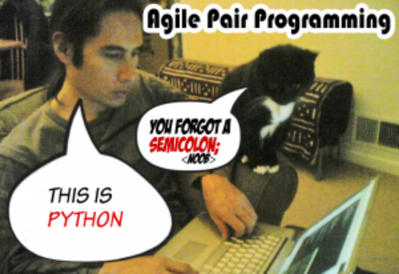

#  Kurze Tour durch mein Entwicklerwohnzimmer

---

# Meine Computersozialisation ...

# Presenter Notes

In vier Bildern erklärt, wo ich herkomme, weil das eventuell auch veranschaulicht, warum ich IDEs so gerne mag.

---

#  1986

# Presenter Notes

Endlose listings abtippen, ohne Code Vervollständigung und Syntax Highlighting auf einer Tastatur mit superschrägem Layout und einem halben Meter Hub ... kein Spaß 

---

#  1989

# Presenter Notes

schon besser ... und mit Omikron Basic und dem mitgelieferten Editor hat programmieren langsam Spaß gemacht ...

---

#  1990er

# Presenter Notes

zig verschiedene PC Tastaturen, natürlich alle mit anderen Layouts

---

#  =>

# Presenter Notes

Gaaanz viele verschiedene schreckliche Tastaturen und grauenvolle Programmierumgebungen

=> Habe früh gelernt tippen zu hassen.

=> **Ich wünsche mir eine IDE, wo ich einfach so lange auf Code vervollständigen klicke, bis das Programm fertig ist** 

---

#  Ich bin kein Fan von Vim

# Presenter Notes

Es gibt verschiedene Typen (grob: VIM und Emacs Fraktionen)

Vim ist eher was für Sologitarristen, die gerne schnelle Licks spielen

Ich komme eher vom Klavier und spiele lieber Accorde als Licks

Symbolmanipulationen sind mir wichtiger (z.B. Name und Move Refactoring)

Eine IDE ist was anderes als ein Text Editor

Programmieren ist auch was anderes als Text editieren

**Geht aber auch ... (siehe später in Plugins)**

http://www.viemu.com/a-why-vi-vim.html

---

# Darum mag ich PyCharm

.fx: larger

# Presenter Notes

**Warnung**

NACHTEILE VON IDES

Information Overflow Gefahr

Langsamer (Start und manchmal Bedienung)

(vielleicht) hindert am Lernen der eigentlichen Technologie

VORTTEILE

Die erzähl ich dann gleich aus meiner Sicht

---

#  Wer hat Erfahrungen mit IDEs?

# Presenter Notes

Was erwartet ihr von einer IDE?

---

#  Was ich erwarte ...

# Presenter Notes

**Eierlegende Wollmilchsau**

Muss ich während der Entwicklung selten verlassen

---

# Kennt jemand [Extreme Programming?](https://de.wikipedia.org/wiki/Extreme_Programming) 

# Presenter Notes

zwei Sachen weiß ich: Kommentare sind Bugs und Pair Programming

**Pair programming ohne pair programmer**

Jemand der auf alles achtet, was ich gern vergesse

... der jeden Syntaxfehler sieht

... der PEP8 Fehler sofort sieht

... der mich auf fehlende Parameter in format strings hinweist

... der alle Feinheiten der verschiedenen Python Versionen kennt

... der weiß wo alle Funktionen, Klassen und Module sind

... der mir beim Fixen der Fehler hilft

---

# Pair Programming ohne Partner

* **Inspections** - statische Code Analyse (IMHO unerreicht von anderen Tools)
* Viele Quick Fixes für Konfigurationsprobleme, fehlende Pakete, Probleme im Code
* Überall kann ich einfach suchen (Projektdateinamen, Edtor, Global, Scope, ...)
* Gute Integration von allen gängigen Entwicklungsaktivitäten
* Guter Visueller Debugger / Profiler

## Automatische Tests

* Schöne Darstellung der Testergebnisse mit Navigation zum betroffenen Code
* Konkrete Testfunktion, Klasse, Modul direkt vom Code aus starten
* Auto rerun von Tests

# Presenter Notes

Code ausführen (Run script, Evaluate Expression)

Compare Files / read diffs

update/commit/push code from VCS (git, mercurial, svn, ...)

create/switch branches/tags

Local History / VCS history

Vor Commit: Code Analyse / Import Optimierung / Todos checken

Share project on Github

Share code / console output as gist

---

# Kann man auch mal ausschalten

# Presenter Notes

den ich aber auch ignorieren kann, wenn es nötig ist **(Quick fix Warnung aus)**

---

#  Und PyCharm kann das?

# Presenter Notes

Ja - und darüber hinaus zeichnet es sich noch aus durch ...

---

## Liebe zum Detail

* ``Esc`` -> spring von überall zurück in den letzten aktiven Editor
* ``Alt+<-`` -> Navigate back
* ``Alt, Alt`` -> Toolfensterknöpfe einblenden
* Totale Navigation! ``Shift, Shift`` ``Strg+o`` / ``Strg+g`` / Goto ... / Quick ... 
* Code Vervollständigung (zwei Stufen) / Autoimport / optimize imports
* Quick Fix! ``Alt+Enter`` (über Fehler/Warnung/Intention) 
* Toolfenster Navigation ist Toggle (z.B. Terminal)
* Editfenster / Suchfenster / Commitffenster /Switcher auf Steroiden
* Editfenster auf Steroiden (Annotations / Code Folding / Code Lens / Changes)
* Suchen und Ersetzen Fenster auf Steroiden (mit Preview)
* Verschiedene Darstellungsmodi (Presentation, Distraction Freee)

**CamelCase / slug_case sensitive Suche und Filter**

# Presenter Notes

**STEROIDE**

``Strg+Tab`` / ``Strg+E`` / ``Strg+k``

**SUCHE**

Suche1: monty-python.jpg -> mp

Suche2: pycharm/wollmilchsa.jpg -> upy/wo

Optionen1: line numbers

Optionen2: code folding

**Und ich brauche an meiner Seite einen Pedanten mit Lexikonwissen, der mir beim Tippen hilft**

---

# Erlernbarkeit 

* ``Help -> Find Action``
* Productivity Guide
* Settings gut strukturiert mit Volltextsuche
* [Sehr gute Dokumentation](https://www.jetbrains.com/pycharm/documentation/)

---

## Unterstützt meine Frameworks und Tools

* Flask
* SQLalchemy
* Zurb Foundation
* Vagrant
* Docker
* Bequemer Datenbankzugriff auf postgres, mysql, slite, ...
* [uvm.](https://www.jetbrains.com/help/pycharm/5.0/languages-and-frameworks.html)

*(Teilweise nur Professional Edition)*

---

# formate, Formate, FORMATE!1!!

* Python / Ruby
* sh / Powershell
* .ignore
* HTML
* JSON / YAML
* Javascript / CoffeScript
* CSS / SCSS / LESS
* Jinja2 / Mako / Django Templates
* SQL (alle gebrächlichen Dialekte)
* Markdown **(Multimarkdown)** / restructuredText / AsciiDoc

**Alles geht irgendwie (Plugins oder Textmate bundles)**

---

#  Konfigurierbarkeit

* Layout der Toolbars (Floating, Docked, Pinned, viele Details anpassbar)
* Optionen direkt in Find Action / Search Everywhere anpassen 
* Alle Farben gut anpassbar / Farbenblindenmodus / Darcula Theme!1!!
* File / Code / Live Templates
* Frei konfigurierbare Maus/Keyboard Shortcuts für wirklich alles
* Selbstkonfigurierbare Quicklists
* Externe Dokumentationsquellen konfigurierbar
* Verwendete Tools (pytest vs unittest; dok formate; requirements.txt)

##  [Plugins!](https://plugins.jetbrains.com/?pycharm)

[Key Promoter](https://plugins.jetbrains.com/plugin/1003) 
| [MultiMarkdown](http://vladsch.com/product/multimarkdown)
| [Bash Support](https://github.com/jansorg/BashSupport)
| [.ignore](https://plugins.jetbrains.com/plugin/7495?pr=pycharm)
| [ideavim](https://confluence.jetbrains.com/display/PYH/Configuring+PyCharm+to+work+as+a+Vim+editor)

---

* Projekt Interpreter
* Projektstruktur (source root, excludes, templates)
* Mehrere Repositories in einem Projekt (synchronisierbare branches)
* Zum Projekt gehörige Datenbanken im Projekt
* [.idea](https://www.jetbrains.com/help/pycharm/5.0/project.html)
* Terminal in Pycharm öffnet Pojektordner (gut mit [direnv](http://direnv.net/))
* Strukturierungshilfen (Favoriten, Bookmarks, QuickLists)
* TODOs werden gescannt und in eigenem Toolfenster angezeigt

# Presenter Notes

**Projektorientiert**

Meine Art zu Arbeiten ist eher Projektorientiert

Z.B. Wechsel in den Projektordner aktiviert automatisch Interpreter

In PyCharm: Terminal öffnet Projektordner und aktiviert richtigen Interpreter

---

#  Danke :)

---

#  Fragen oder Wünsche für den Python Vortrag?

* Warum und wie arbeitest du (bei Avira) mit Python?
* Gibt es auch noch andere Einsatzgebiete wo sich Python anbietet?
* Wo eignet sich eine andere Sprache vielleicht besser?
* Werkzeuge eines Softwareentwickelts (z.B. Git)
* Wie kann man nach dem Kurs weiter machen? (Kurse, OpenSource Projekte etc.)
* Vorstellung von Avira 
