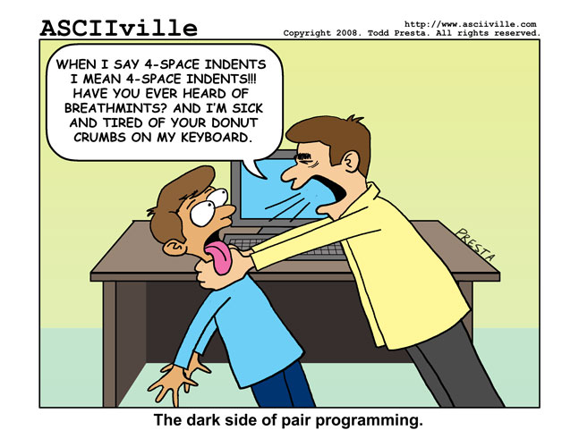

# FIXME -> bullet points to notes; more images

# Kurze Tour durch mein Entwicklerwohnzimmer

---

#  Jetbrains PyCharm

---

#  Was erwarte ich von einer IDE?

.notes: blr

---

---

# Pair programming ohne pair programmer

---

---

# Presenter Notes

* Jemand der den Code in und auswendig kennt
* jemand der jeden Syntax fehler sieht
* fehlende Parameter in format string
* hilft beim fixen
* kennt alle stdlib features

---

Mehr als ein Text Editor. Programmieren ist ja auch viel mehr als nur Text editieren.

---

Was erwart ich nicht?

* Super sophistiv

---

pair programmer

---

# Passt zu meiner Art zu Arbeiten

---

## Projektorientiert

* [.idea](https://www.jetbrains.com/help/pycharm/5.0/project.html)
* Projektstruktur (source root, excludes, templates)
* Projekt Interpreter
* Mehrere Repositories in einem Projekt (synchronisierbare branches)
* Datenbankdetails

---

## Unterstützt meine Frameworks und Tools

[Teilweise nur Professional Edition](https://www.jetbrains.com/help/pycharm/5.0/languages-and-frameworks.html)

* Flask
* sqlalchemy
* Foundation
* vagrant
* Docker

---

### formate, Formate, FORMATE

* Python
* SQL
* Direkter Datenbankzugriff
* Javascript
* CSS / SCSS / LESS
* HTML
* YAML
* JSON
* Jinja2
* Bash
* Markdown (sehr gut mit Multimarkdown)
* restructuredText
* Ruby (Vagrantfiles) -> textmate bundle

## Erlernbarkeit und Konfigurierbarkeit

* Productivity Guide
* Help -> Find Action
* Settings gut strukturiert mit Suchfunktion
* [Plugins!](https://plugins.jetbrains.com/?pycharm)
    * [Key Promoter](https://plugins.jetbrains.com/plugin/1003)
    * [MultiMarkdown](http://vladsch.com/product/multimarkdown)
    * [Bash Support](https://github.com/jansorg/BashSupport)
    * [.ignore](https://plugins.jetbrains.com/plugin/7495?pr=pycharm)
    * [Databse Navigator](https://confluence.jetbrains.com/display/CONTEST/Database+Navigator)
**
---

# Hilfe bekommen

* [Sehr gute Dokumentation](https://www.jetbrains.com/pycharm/documentation/)
* Statische Code Analyse (MMn unerreicht von anderen Tools)
* Viele Quick Fixes für Konfigurationsprobleme, fehlende Pakete, Probleme im Code
* Gute Integration mit Entwicklungsaktivitäten
    * Code ausführen (Run script, Evaluate Expression)
    * update/commit/push code from VCS (git, mercurial, svn, ...)
    * create/switch branches/tags
    * Local History / VCS history
    * Compare Files / read diffs
    * Vor Commit: Code Analyse / Import Optimierung / Todos checken
    * Share project on Github
    * Share code / console output as gist
* Überall kann man einfach suchen (Projektdateinamen, Edtor, Global, Scope, ...)

---

## Liebe zum Detail

* ``Esc`` springt immer zurück in den Editor
* ``Alt, Alt`` -> Toolfensterknöpfe einblenden
* ``Shift, Shift`` -> Search Everywhere
* ``F1`` -> Terminal einblenden und wieder ausblenden
* CamelCase / slug_case aware search everywhere 
    * monty-python.jpg -> mp
    * pycharm/wollmilchsa.jpg -> upy/wo
* Optionen direkt in Find Action / Search Everywhere anpassen 
    * line numbers
    * code folding
* Toolfenster Navigation (z.B. ``Alt+<1-9>`` - frei konfigurierbar)
* Toolfenster konfigurierbar (Floating, Docked, Pinned)
* Favoriten, Bookmarks, QuickLists
* Modes (Presentation, Distraction Freee)
* Darcula Theme!1!!

---

# Bequemlichkeit

* Code Vervollständigung
* Code Navigation
* Switcher (``Strg+Tab``, Recent Files: ``Strg+E``)
* TODOs werden gescannt und in Toolfenster angezeigt
* Schnelle Erreichbarkeit aller wichtigen Funktionen
* Individualisierung 
    * Frei konfigurierbare Maus/Keyboard Shortcuts für alles
    * selbstkonfigurierbare Quicklists
* File / Code / Live Templates

---

# Analyse / Fehlervermeidung / Optimierung

* Code inspections mit Quick Fixes direkt im Editor
* Guter Visueller Debugger
* Visueller Profiler

---

# Testen

* Tools -> Python Integrated Tools
* Schöne Darstellung, mit Navigation zum betroffenen Code
* Konkrete Testfunktion, Klasse, Modul vom Code aus starten
* Auto rerun von Tests
